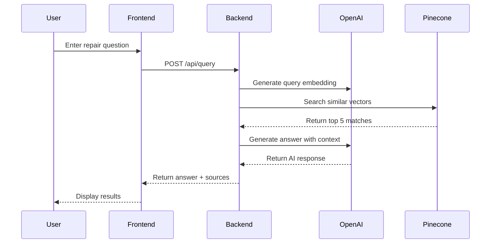
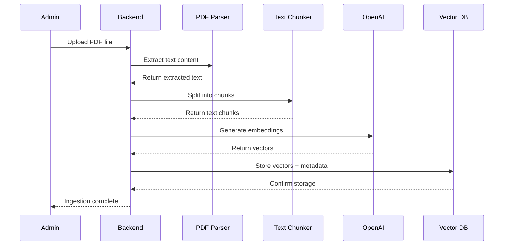
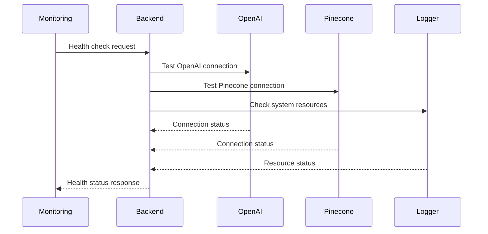

# RV Repair Copilot - System Architecture

## Overview

RV Repair Copilot is a modern, scalable AI-powered platform built with a microservices architecture that combines natural language processing, vector search, and comprehensive knowledge management to provide instant RV repair guidance.

## System Architecture

```
┌─────────────────────────────────────────────────────────────────┐
│                        Frontend Layer                          │
├─────────────────────────────────────────────────────────────────┤
│  React PWA  │  Mobile Web  │  Desktop Web  │  Admin Panel   │
└─────────────────────────────────────────────────────────────────┘
                                │
                                ▼
┌─────────────────────────────────────────────────────────────────┐
│                      API Gateway Layer                         │
├─────────────────────────────────────────────────────────────────┤
│  Rate Limiting  │  CORS  │  Authentication  │  Request Logging │
└─────────────────────────────────────────────────────────────────┘
                                │
                                ▼
┌─────────────────────────────────────────────────────────────────┐
│                     Backend Services                           │
├─────────────────────────────────────────────────────────────────┤
│  Query Service  │  Ingestion Service  │  Health Service  │
└─────────────────────────────────────────────────────────────────┘
                                │
                                ▼
┌─────────────────────────────────────────────────────────────────┐
│                    AI & ML Services                            │
├─────────────────────────────────────────────────────────────────┤
│  OpenAI GPT-4  │  Embedding Service  │  RAG Pipeline   │
└─────────────────────────────────────────────────────────────────┘
                                │
                                ▼
┌─────────────────────────────────────────────────────────────────┐
│                    Data Storage Layer                          │
├─────────────────────────────────────────────────────────────────┤
│  Pinecone Vector DB  │  File Storage  │  Logs & Metrics │
└─────────────────────────────────────────────────────────────────┘
```

## Core Components

### 1. Frontend Application

#### Technology Stack
- **Framework**: React 18 with TypeScript
- **Styling**: TailwindCSS with custom design system
- **State Management**: React Query for server state
- **Routing**: React Router v6
- **Animations**: Framer Motion
- **Build Tool**: Vite
- **PWA**: Service worker with offline capabilities

#### Architecture Patterns
- **Component-Based**: Reusable, composable UI components
- **Container/Presenter**: Separation of logic and presentation
- **Custom Hooks**: Reusable business logic
- **Error Boundaries**: Graceful error handling
- **Lazy Loading**: Code splitting for performance

#### Key Components
```typescript
// Component hierarchy
App
├── Header (Navigation, Dark Mode Toggle)
├── Main Content
│   ├── Home (Search, Features, Examples)
│   ├── About (Company Info, Features)
│   ├── Contact (Contact Form, Support)
│   └── NotFound (404 Page)
└── Footer (Links, Social Media)
```

### 2. Backend API

#### Technology Stack
- **Runtime**: Node.js 18+ with TypeScript
- **Framework**: Express.js with middleware stack
- **Validation**: Joi/Zod for request validation
- **Logging**: Winston with structured logging
- **Security**: Helmet, CORS, Rate Limiting
- **File Handling**: Multer for multipart uploads

#### Service Architecture
```typescript
// Service layer structure
src/
├── app.ts                 # Main application entry
├── routes/               # API route definitions
│   ├── query.ts         # Search and query endpoints
│   ├── ingest.ts        # Content ingestion endpoints
│   └── health.ts        # Health check endpoints
├── services/            # Business logic services
│   ├── openaiClient.ts  # OpenAI API integration
│   ├── vectorDB.ts      # Pinecone vector database
│   └── ragPipeline.ts   # RAG orchestration
└── utils/               # Utility functions
    ├── logger.ts        # Logging configuration
    ├── pdfParser.ts     # PDF text extraction
    └── textChunker.ts   # Text segmentation
```

#### API Endpoints
```typescript
// Core API structure
POST   /api/query         # Search for repair information
POST   /api/ingest/pdf    # Upload and process PDFs
GET    /api/health        # System health status
GET    /api/query/stats   # Search statistics
DELETE /api/ingest/clear  # Clear ingested data
```

### 3. AI & ML Services

#### OpenAI Integration
- **GPT-4 Model**: `gpt-4-1106-preview` for complex reasoning
- **Embedding Model**: `text-embedding-ada-002` for vector generation
- **Context Window**: 128K tokens for comprehensive responses
- **Temperature**: Configurable for creativity vs. accuracy

#### RAG Pipeline
```typescript
// RAG pipeline flow
User Query → Embedding Generation → Vector Search → Context Retrieval → GPT-4 Response → Answer + Sources
```

#### Vector Database (Pinecone)
- **Dimensions**: 1536 (OpenAI embedding size)
- **Metric**: Cosine similarity for semantic search
- **Index Type**: Production-grade p1.x1 pods
- **Metadata**: Rich filtering and search capabilities

### 4. Data Processing Pipeline

#### Content Ingestion
```typescript
// Ingestion workflow
PDF Upload → Text Extraction → Text Chunking → Embedding Generation → Vector Storage → Index Update
```

#### Text Processing
- **Chunking Strategy**: Semantic boundary preservation
- **Overlap**: Configurable overlap for context continuity
- **Size Limits**: Configurable chunk sizes (500-2000 tokens)
- **Quality Filters**: Content validation and cleaning

#### Metadata Management
- **Required Fields**: brand, component, manualType, source
- **Optional Fields**: year, model, difficulty, safety level
- **Indexed Fields**: All metadata for efficient filtering
- **Search Optimization**: Metadata-based query refinement

## Data Flow

### 1. User Query Flow



### 2. Content Ingestion Flow



### 3. System Health Monitoring



## Security Architecture

### 1. API Security
- **Rate Limiting**: Configurable per-endpoint limits
- **CORS Protection**: Origin validation and restrictions
- **Input Validation**: Request sanitization and validation
- **Error Handling**: Secure error messages without information leakage

### 2. Data Protection
- **Environment Variables**: Secure configuration management
- **API Key Security**: Secure storage and transmission
- **HTTPS Enforcement**: Production HTTPS requirements
- **Access Control**: Role-based access for admin functions

### 3. Content Security
- **File Validation**: PDF format and size validation
- **Content Filtering**: Malicious content detection
- **Upload Limits**: File size and type restrictions
- **Virus Scanning**: Optional malware detection

## Performance Architecture

### 1. Frontend Performance
- **Code Splitting**: Route-based lazy loading
- **Image Optimization**: WebP format with fallbacks
- **Caching Strategy**: Service worker for offline support
- **Bundle Optimization**: Tree shaking and minification

### 2. Backend Performance
- **Connection Pooling**: Database connection management
- **Request Caching**: Redis-based response caching
- **Async Processing**: Non-blocking I/O operations
- **Load Balancing**: Horizontal scaling support

### 3. AI Service Performance
- **Batch Processing**: Efficient embedding generation
- **Context Optimization**: Smart context selection
- **Response Caching**: Common query result caching
- **Fallback Strategies**: Graceful degradation

## Scalability Considerations

### 1. Horizontal Scaling
- **Stateless Design**: No session state dependencies
- **Load Balancing**: Multiple backend instances
- **Database Sharding**: Vector index partitioning
- **CDN Integration**: Global content delivery

### 2. Vertical Scaling
- **Resource Monitoring**: CPU, memory, and I/O tracking
- **Performance Profiling**: Bottleneck identification
- **Resource Allocation**: Dynamic resource scaling
- **Optimization**: Query and algorithm optimization

### 3. Data Scaling
- **Index Optimization**: Pinecone index tuning
- **Chunking Strategy**: Adaptive chunk size optimization
- **Metadata Indexing**: Efficient filtering and search
- **Backup Strategy**: Automated backup and recovery

## Monitoring & Observability

### 1. Application Metrics
- **Response Times**: API endpoint performance
- **Error Rates**: Error tracking and alerting
- **Throughput**: Request volume and capacity
- **Resource Usage**: CPU, memory, and disk utilization

### 2. Business Metrics
- **Query Volume**: Daily search queries
- **Success Rate**: Successful query percentage
- **User Engagement**: Session duration and interactions
- **Content Coverage**: Knowledge base completeness

### 3. Infrastructure Metrics
- **Database Performance**: Query latency and throughput
- **AI Service Health**: OpenAI API response times
- **File Storage**: Upload/download performance
- **Network Latency**: End-to-end response times

## Deployment Architecture

### 1. Development Environment
- **Docker Compose**: Local service orchestration
- **Hot Reloading**: Development server with auto-restart
- **Environment Variables**: Local configuration management
- **Database Seeding**: Sample data for development

### 2. Staging Environment
- **Production Parity**: Identical to production setup
- **Data Isolation**: Separate databases and services
- **Testing Integration**: Automated testing and validation
- **Performance Testing**: Load and stress testing

### 3. Production Environment
- **Container Orchestration**: Kubernetes or similar
- **Auto-scaling**: Dynamic resource allocation
- **Blue-Green Deployment**: Zero-downtime updates
- **Monitoring Integration**: Full observability stack

## Future Architecture Considerations

### 1. Microservices Evolution
- **Service Decomposition**: Break down monolithic backend
- **API Gateway**: Centralized routing and management
- **Service Mesh**: Inter-service communication
- **Event-Driven Architecture**: Asynchronous processing

### 2. Advanced AI Features
- **Multi-Modal Support**: Image and video processing
- **Real-Time Learning**: Continuous model improvement
- **Personalization**: User-specific recommendations
- **Predictive Analytics**: Maintenance forecasting

### 3. Edge Computing
- **CDN Integration**: Global content distribution
- **Edge AI**: Local AI processing capabilities
- **Offline Support**: Enhanced offline functionality
- **Mobile Optimization**: Native mobile app support

---

**Note**: This architecture document is a living document that should be updated as the system evolves. Regular reviews and updates ensure alignment with current implementation and future requirements.